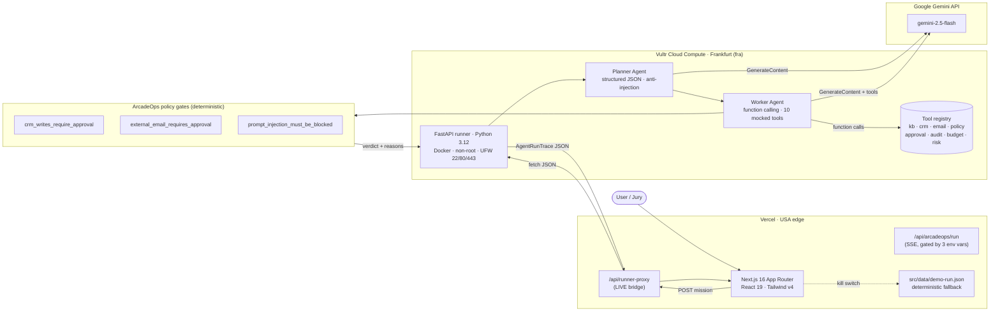

# ArcadeOps Control Tower

> **Gemini runs the agent. Vultr executes the workflow. ArcadeOps decides if it can ship.**

[](https://arcadeops-control-tower-hackathon.vercel.app/control-tower)
[](http://136.244.89.159/health)
[](https://ai.google.dev/gemini-api)
[](https://nextjs.org)
[](runner/)
[](LICENSE)
[](https://lablab.ai)

ArcadeOps Control Tower is the production gate for autonomous AI agents.
A multi-agent system on **Vultr** runs **Gemini 2.5 Flash** with real
function calling against ten mocked enterprise tools, then **ArcadeOps**
applies non-negotiable policy gates before anything risky ever ships.
Built end-to-end in seven days for the **Milan AI Week 2026** hackathon
(sponsors: Google Gemini + Vultr).

---

## Live demo

### 60-second jury tour (clickable, no setup)

1. Open <https://arcadeops-control-tower-hackathon.vercel.app/control-tower>.
2. Scroll to **panel 1 · Pick an agent run** and hit the small dotted
   text link **"Or replay the deterministic safe sample (no key
   required)"** at the bottom of the panel — this swaps panel 2 to the
   live-mode launcher.
3. Click the green **⚡ Run live with ArcadeOps backend** button (with
   the violet **"Gemini + Vultr"** inline pill) that just appeared in
   panel 2. Watch phase pills, the execution timeline, tool calls
   (`kb.search`, `crm.lookup`, `policy.check`, `email.draft`,
   `approval.request`, `audit.log` …), the observability panel and the
   BLOCKED verdict stream in live.
4. Click **Run Gemini reliability judge** in panel 3. A second Gemini
   call audits the trace and produces a structured verdict (top risks,
   missing evidence, remediation plan).
5. Toggle guardrails in panel **4** and **Re-score with guardrails** to
   see the verdict flip from `Block` to `Ship`.

> The green button is the **only** Vultr + Gemini live trigger. The
> purple **"Run Gemini judge"** button further down (panel 3 in scenario
> mode) only audits the bundled scenario trace fixture — it is not the
> live path and will not produce the 23 s / 16 k tokens / $0.0014
> numbers reported below.

Everything runs against a real Vultr VM in Frankfurt (`fra`) protected
by a `x-runner-secret` header (set as Vercel env vars). The
`GEMINI_API_KEY` lives only on the VM; it never reaches the browser or
any Vercel env.

### One-curl proof (server-side)

```bash
curl -sS -X POST \
  https://arcadeops-control-tower-hackathon.vercel.app/api/runner-proxy \
  -H "Content-Type: application/json" \
  -d '{"mission":"VIP customer threatens to churn after SLA breach"}'
```

Last smoke (Lot 5 FULL, `2026-05-13`, post re-provision) — `HTTP 200`,
`23.44 s` wall-clock, `16 322` Gemini tokens, `$0.001424` total cost,
verdict `BLOCKED` (3 policy gates), 8 trace steps, 7 tool calls,
`is_mocked: false`. Run id `1f97ad20ab8f47949d77913e57817d0f`.

### Architecture (Lot 5 FULL hardening)

- **Frontend** — `/control-tower` page →
  `/api/arcadeops/run` (Lot 5 SSE compat layer) →
  `POST ${RUNNER_URL}/run-agent` with `x-runner-secret` header.
- **Runner** — FastAPI middleware kill-switch
  `RUNNER_REQUIRE_SECRET=1` enforces shared-secret authentication via
  `hmac.compare_digest`; `/health` stays public for cloud probes.
- **Plain JSON fallback** — `/api/runner-proxy` continues to return
  the raw `AgentRunTrace` for debugging or external tooling.

> Tip: open [`docs/HOW_TO_DEMO.md`](docs/HOW_TO_DEMO.md) for the
> deeper jury walkthrough plus plan B/C and prepared Q&A.

---

## Architecture in one diagram



For the full sequence, component, deployment, security and reliability
diagrams see [`docs/ARCHITECTURE.md`](docs/ARCHITECTURE.md).

---

## Why we win

- **Real multi-agent design, not a single-shot prompt.** A Planner emits
  a strict JSON plan (no tools, anti-injection in the system prompt) and
  a Worker executes it via Gemini function calling against ten typed
  mocked tools. Every step is logged with role, phase, summary, tool
  call args, result, latency and risk level.
- **Three policy gates that actually block.** ArcadeOps Control Tower
  applies deterministic, server-side gates after Gemini reasoning.
  In our flagship "VIP churn" run, three of them fire and force a
  `BLOCKED` verdict — no destructive CRM write, no outbound email, no
  prompt-injected payload reaches a real system.
- **Live proof, not slideware.** Every figure in this README comes from
  a real `2026-05-13` smoke against production (post Lot 5 FULL
  re-provision): 23.44 s wall-clock, 16 322 Gemini tokens, $0.001424
  per run, 8 trace steps, 7 tool calls, `BLOCKED` verdict.
- **Sponsor-native.** The architecture is "Gemini does the hard
  reasoning, Vultr runs the workload, Vercel ships the UI" — each
  sponsor is doing exactly what they are best at, not a token logo on a
  slide.
- **Defense in depth.** Hardened Worker (wall-clock deadline, retry on
  transient errors only, hallucinated tools handled, cap on tool calls,
  cap on turns), runner-side fixture fallback, frontend deterministic
  trace fallback, kill-switch env vars on the proxy.
- **Observability + cost discipline.** Token usage and `$cost_usd` are
  computed from Gemini's `usage_metadata` on every run with the
  published `gemini-2.5-flash` price (input $0.075/M, output $0.30/M).
  Structured logging on the FastAPI side, Pydantic models all the way.
- **Security by construction.** `GEMINI_API_KEY` lives only inside the
  Vultr VM, never on Vercel. The runner runs as a non-root Docker user
  behind UFW (22/80/443 only). Cloud-init provisioning means **zero
  SSH** is ever required to ship a fresh runner.

---

## Tech stack

| Layer            | Choice                                                                                  |
| ---------------- | --------------------------------------------------------------------------------------- |
| Frontend         | Next.js 16.2.6 (App Router), React 19.2.4, Tailwind CSS v4, shadcn-style components, TypeScript strict |
| Frontend hosting | Vercel (USA edge, Production deployment)                                                |
| Runner           | FastAPI, Python 3.12-slim, Pydantic v2, Pydantic-Settings, `google-genai` ≥ 0.3         |
| Runner hosting   | Vultr Cloud Compute · `vc2-1c-2gb` · Frankfurt (`fra`) · $5/month                       |
| LLM              | Google Gemini API · `gemini-2.5-flash` · function calling + structured JSON              |
| Container        | Docker multi-stage · non-root `appuser` · `HEALTHCHECK` baked in · `docker compose`      |
| Provisioning     | PowerShell + Bash (`scripts/vultr-provision.ps1`, `vultr-provision.sh`) + cloud-init template |
| Reverse proxy    | Caddy on the VM (`:80 -> 127.0.0.1:8000`)                                               |
| Firewall         | UFW · `22/tcp`, `80/tcp`, `443/tcp` only                                                |
| Observability    | Pydantic-modelled traces · structured `logging` · `usage_metadata` cost tracking        |

---

## How to demo in 60 seconds (curl-only fallback)

> The clickable jury tour is **§ "Live demo · 60-second jury tour"**
> above (with the prerequisite click on the *replay the deterministic
> safe sample* link). The terminal-only path below is the back-up if
> the UI misbehaves on demo day.

1. Open https://arcadeops-control-tower-hackathon.vercel.app
2. In a terminal, paste:

   ```bash
   curl -sS -X POST \
     https://arcadeops-control-tower-hackathon.vercel.app/api/runner-proxy \
     -H "Content-Type: application/json" \
     -d '{"mission":"VIP customer threatens to churn after SLA breach"}' | jq .
   ```

3. Show the live multi-agent trace coming back: `agents_involved` =
   `[PLANNER, WORKER]`, `is_mocked: false`, `model: gemini-2.5-flash`,
   `runner: vultr`.
4. Scroll to `verdict`. Read the three triggered policy gates. Read the
   prompt-injected `customer_note` flagged as a `CRITICAL`
   `prompt_injection` finding.
5. Punchline: **"Gemini ran the agent. Vultr ran the workflow.
   ArcadeOps refused to ship it."**

Full script with B-roll and timing — [`docs/VIDEO_SCRIPT_90S.md`](docs/VIDEO_SCRIPT_90S.md).

---

## Local development

```bash
# 1. Frontend (Next.js 16)
npm install
npm run dev      # http://localhost:3000

# 2. Runner (FastAPI · in a separate terminal)
cd runner
docker compose up --build   # http://localhost:8000/health
```

Replay-only mode works with **zero env vars**. To enable the live Gemini
multi-agent run, copy [`runner/.env.example`](runner/.env.example) to
`runner/.env` and set `GEMINI_API_KEY` (Google AI Studio).

---

## Production architecture

The deployed pipeline is a **two-cloud setup with one shared secret model**:

- **Vercel** hosts the Next.js frontend and the `/api/runner-proxy`
  Node.js route. The proxy strips CRLF from `RUNNER_URL`, enforces an
  85 s `AbortSignal.timeout`, and never sees `GEMINI_API_KEY`.
- **Vultr** runs the FastAPI multi-agent runner inside Docker on a
  single `vc2-1c-2gb` VM in Frankfurt (`136.244.89.159`). UFW only opens
  22/80/443. Caddy reverse-proxies port 80 to the runner on
  `127.0.0.1:8000`. A FastAPI middleware enforces an `x-runner-secret`
  shared-secret header (kill-switch `RUNNER_REQUIRE_SECRET=1`), so
  unauthenticated callers get a clean 401 without ever touching Gemini.
- **Google Gemini API** is reached only from Vultr. The key is injected
  via cloud-init at provisioning time and lives in
  `/opt/arcadeops/.env` with `0600` perms.
- **Provisioning is one command**: `scripts/vultr-provision.ps1`
  (Windows) or `scripts/vultr-provision.sh` (Linux/macOS) creates the
  VM, renders the cloud-init template (`scripts/vultr-cloud-init.yaml.template`)
  with the API key, and waits for `/health` to return 200.

For the full deployment runbook see
[`docs/runbooks/DEPLOYMENT_VULTR.md`](docs/runbooks/DEPLOYMENT_VULTR.md)
and [`docs/VULTR_DEPLOYMENT.md`](docs/VULTR_DEPLOYMENT.md).

---

## Sponsors integration

### Google Gemini · `gemini-2.5-flash`

- **Multi-agent reasoning**: a Planner produces a strict JSON plan
  using `response_mime_type="application/json"` + a hardened anti-injection
  system prompt; a Worker executes the plan with **native function
  calling** against ten declared tools (see
  [`runner/app/llm/function_calling.py`](runner/app/llm/function_calling.py)).
- **Structured output**: every Planner call asks Gemini for a JSON
  object with a fixed schema (`objective`, `steps`, `target_tools`,
  `constraints`).
- **Cost tracking** is computed from `response.usage_metadata`
  (`prompt_token_count`, `candidates_token_count`) using the published
  `gemini-2.5-flash` rates. Last smoke: 16 322 tokens, $0.001424.
- **Resilience**: per-call wall-clock timeout (30 s), exponential
  backoff `[1s, 2s]`, transient-only retry classification, tool
  hallucinations gracefully degraded into a structured `unknown_tool`
  error step instead of crashing the run.

### Vultr · Cloud Compute

- **Hosting** — single `vc2-1c-2gb` VM in `fra` (Frankfurt) at
  `136.244.89.159`, $5/month (re-provisioned via cloud-init during
  Lot 5 FULL Mission B-deploy-1).
- **Cloud-init automated provisioning** — see
  [`scripts/vultr-cloud-init.yaml.template`](scripts/vultr-cloud-init.yaml.template).
  The template installs Docker, Caddy, UFW, clones the repo, writes
  `/opt/arcadeops/.env` with the Gemini key, runs `docker compose up`,
  and locks the firewall down to 22/80/443. **Zero SSH required to
  ship a fresh runner.**
- **Idempotent CLI** — `scripts/vultr-provision.ps1` supports
  `-DryRun`, `-Force`, `-CloudInitPath` and persists state to
  `.vultr-state.json` so `Ctrl+C` is always safe to retry.

---

## Roadmap (post-hackathon)

1. **Persistent runs** — wire `/runs/{run_id}` to a small SQLite or
   Vultr Object Storage backend so traces survive a runner restart.
2. **MCP-native tools** — expose the 10 mocked tools through a real MCP
   server inside the runner (the registry already declares
   `MCP_COMPATIBLE` source for `risk.scan`).
3. **Multi-region runners** — add `-Region` flag to
   `vultr-provision.ps1` and route from Vercel to the closest healthy
   runner.
4. **Real approval workflow** — turn `approval.request` into a real
   webhook + UI inbox so a human can flip a `BLOCKED` run to `SHIP` in
   one click, with full audit trail.
5. **Secret rotation playbook** — automate `RUNNER_SECRET` rotation
   between the Vultr cloud-init slot and Vercel env vars without
   downtime.

> ✅ **Lot 5 FULL — landed.** `/api/arcadeops/run` is now an SSE compat
> layer over the Vultr runner, `x-runner-secret` middleware enforces
> shared-secret auth (kill-switch `RUNNER_REQUIRE_SECRET=1`), and the
> `/control-tower` page renders the trace live from real Gemini frames.

---

## Team

- **[Your name]** — design, frontend, runner, infra, pitch.

(Hackathon solo build. Author placeholder until the repo ships public.)

---

## Project map

```text
arcadeops-control-tower-hackathon/
├── src/                                  # Next.js 16 App Router
│   ├── app/
│   │   ├── api/runner-proxy/route.ts     # Vercel -> Vultr LIVE bridge (PASS)
│   │   ├── api/arcadeops/run/route.ts    # SSE proxy to ArcadeOps (V4+V5)
│   │   ├── api/gemini/judge/route.ts     # Frontend Gemini judge (existing)
│   │   ├── api/replay/                   # Deterministic replay SSE
│   │   ├── api/capabilities/             # Runtime feature detection
│   │   └── api/health/                   # Frontend health
│   ├── components/control-tower/         # DemoMissionLauncher, EventTimeline,
│   │                                     # GeminiJudgePanel, ToolCallCard, ...
│   ├── lib/control-tower/                # Normalizers, types, policy-gates,
│   │                                     # verdict-consistency, sse, scenarios
│   └── data/demo-run.json                # Sanitized fixture trace
├── runner/                               # FastAPI Vultr runner
│   ├── app/main.py
│   ├── app/orchestrator.py               # Planner -> Worker -> trace
│   ├── app/agents/{planner,worker}.py
│   ├── app/llm/{gemini_client,function_calling}.py
│   ├── app/tools/{registry,implementations}.py    # 10 mocked tools
│   ├── app/models/trace.py               # AgentRunTrace, RunVerdict, PolicyGate
│   ├── app/fixtures/{vip_churn,safe_research}_trace.json
│   ├── Dockerfile + docker-compose.yml
│   └── requirements.txt
├── scripts/
│   ├── vultr-provision.ps1               # Idempotent · dry-run · cloud-init
│   ├── vultr-provision.sh
│   ├── vultr-destroy.{ps1,sh}            # Force-destroy with confirmation
│   └── vultr-cloud-init.yaml.template
├── docs/
│   ├── ARCHITECTURE.md                   # Mermaid sequence/component/deploy
│   ├── HOW_TO_DEMO.md                    # 60 s jury demo + plan B/C + Q&A
│   ├── FEATURES.md                       # Exhaustive feature catalogue
│   ├── SUBMISSION_LABLAB.md              # Lablab.ai submission body
│   ├── VIDEO_SCRIPT_90S.md               # 90 s storyboard (EN + FR notes)
│   ├── VULTR_DEPLOYMENT.md
│   ├── implementation/                   # Lot plans (worker-managed)
│   └── runbooks/DEPLOYMENT_VULTR.md
├── CHANGELOG.md
└── README.md
```

---

## License

Released under the MIT License — see [`LICENSE`](LICENSE). The repo is
private until the jury review window, then it goes public for the
Lablab.ai submission.
