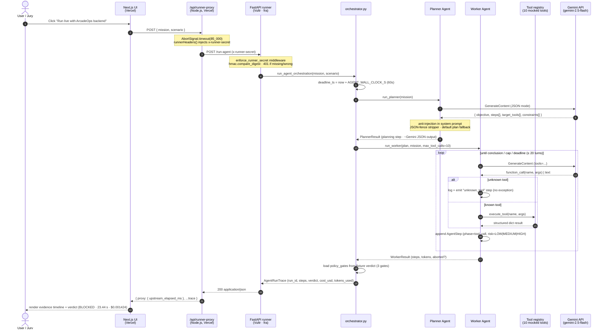
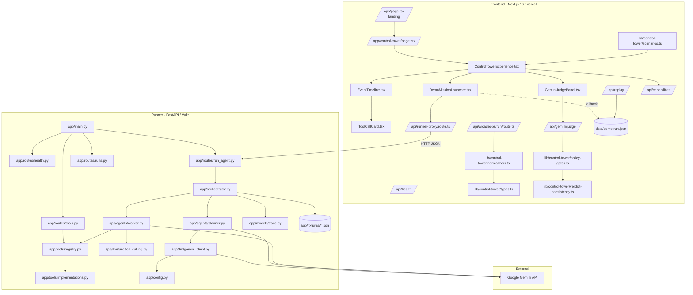
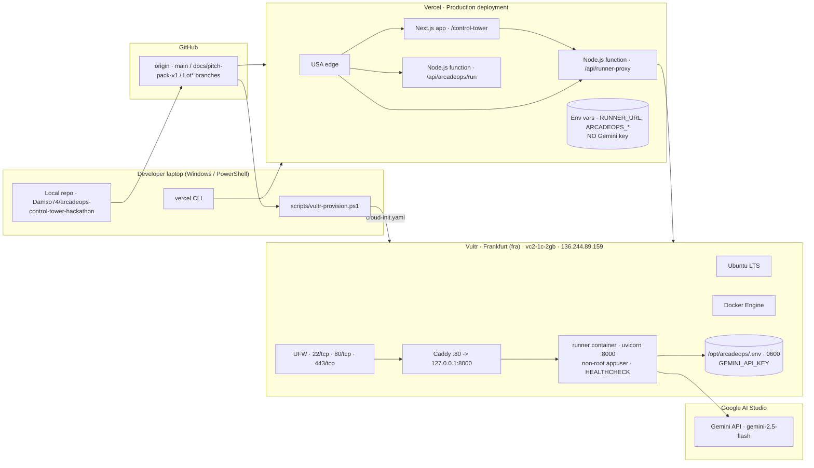
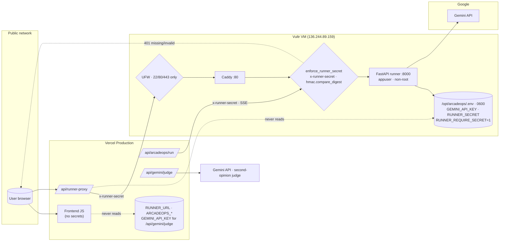
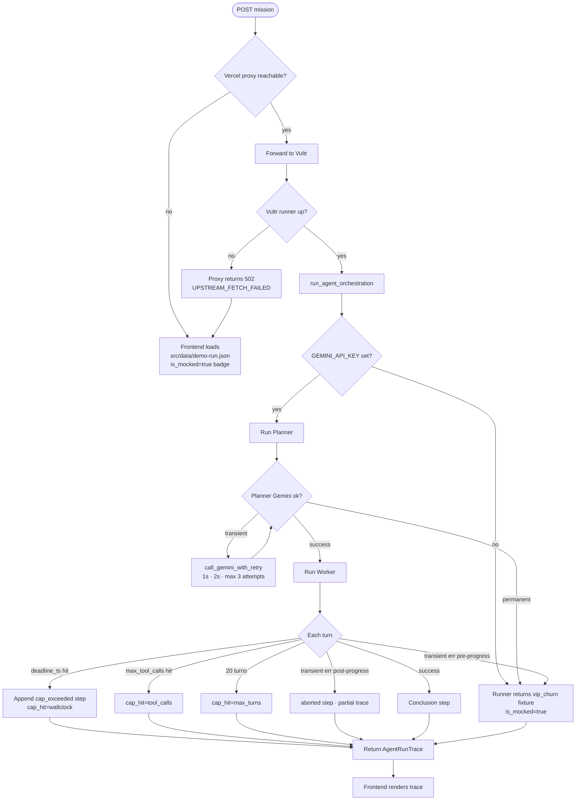

# ArcadeOps Control Tower — Architecture

> Real, deployed, end-to-end. Every diagram below corresponds to running
> code in this repository — not a future-state aspiration.

This document is the canonical architectural reference for the
hackathon submission. It covers six perspectives:

1. [Sequence diagram — request lifecycle](#1-sequence-diagram--request-lifecycle)
2. [Component diagram — modules and contracts](#2-component-diagram--modules-and-contracts)
3. [Deployment diagram — where each piece runs](#3-deployment-diagram--where-each-piece-runs)
4. [Data flow — trace event lifecycle](#4-data-flow--trace-event-lifecycle)
5. [Security model — secrets and trust boundaries](#5-security-model--secrets-and-trust-boundaries)
6. [Reliability model — fallback chain and cost caps](#6-reliability-model--fallback-chain-and-cost-caps)

---

## 1. Sequence diagram — request lifecycle

The diagram below traces a `POST /api/runner-proxy` (or the SSE
`/api/arcadeops/run`) request from the jury's browser all the way to
Gemini and back, including every retry, deadline and gate. Times in
parentheses are wall-clock numbers from the post Lot 5 FULL
`2026-05-13` smoke run (`run_id 1f97ad20ab8f47949d77913e57817d0f`,
new VM `136.244.89.159`).



Key timeouts and caps written in code:

- **Vercel proxy** — `AbortSignal.timeout(85_000)` — see
  [`src/app/api/runner-proxy/route.ts`](../src/app/api/runner-proxy/route.ts).
- **Orchestrator wall-clock** — `AGENT_WALL_CLOCK_S = 60 s` — see
  [`runner/app/config.py`](../runner/app/config.py).
- **Worker turn cap** — 20 turns — see
  [`runner/app/agents/worker.py`](../runner/app/agents/worker.py).
- **Worker tool-call cap** — `MAX_TOOL_CALLS = 10` — see config.
- **Per-Gemini-call timeout** — 30 s with backoff `[1 s, 2 s]` retry on
  transient errors only — see
  [`runner/app/llm/gemini_client.py`](../runner/app/llm/gemini_client.py).

---

## 2. Component diagram — modules and contracts



Key contracts:

- The **Control Tower event model** in
  [`src/lib/control-tower/types.ts`](../src/lib/control-tower/types.ts)
  defines `phase_change | step | tool_call | token | observability |
  result | done | error | heartbeat`.
- The **trace contract** in
  [`runner/app/models/trace.py`](../runner/app/models/trace.py) defines
  `AgentRunTrace { run_id, runner, region, model, mission,
  agents_involved, tools_available, steps[], verdict, started_at,
  completed_at, cost_usd, tokens_used, is_mocked }`.
- The **tool registry** is JSON-first
  ([`runner/app/fixtures/tool_registry.json`](../runner/app/fixtures/tool_registry.json))
  with one Python implementation per tool in
  [`runner/app/tools/implementations.py`](../runner/app/tools/implementations.py).

---

## 3. Deployment diagram — where each piece runs



Real values in this deployment:

| Field                  | Value                                                  |
| ---------------------- | ------------------------------------------------------ |
| Vercel project         | `arcadeops-control-tower-hackathon`                    |
| Frontend URL           | https://arcadeops-control-tower-hackathon.vercel.app   |
| Primary demo path      | `/control-tower` (SSE via `/api/arcadeops/run`)        |
| `RUNNER_URL` (Vercel)  | `http://136.244.89.159`                                |
| Runner auth (Vercel)   | `RUNNER_SECRET` env var → `x-runner-secret` header     |
| Runner auth (Vultr)    | `RUNNER_REQUIRE_SECRET=1` middleware kill-switch       |
| Vultr region           | `fra` · Frankfurt                                      |
| Vultr plan             | `vc2-1c-2gb` · $5/month                                |
| Public IP              | `136.244.89.159` (re-provisioned via cloud-init, Lot 5 FULL B-deploy-1) |
| Open ports             | `22/tcp`, `80/tcp`, `443/tcp` (UFW)                    |
| Reverse proxy          | Caddy on `:80` -> `127.0.0.1:8000`                     |
| Container user         | `appuser` (non-root)                                   |
| Gemini model           | `gemini-2.5-flash`                                     |

Reachability cross-check (from `.smoke-checkhost-prod.json`,
`2026-05-13`):

- `de1.node.check-host.net` — 200 OK in 14 ms
- `nl1.node.check-host.net` — 200 OK in 24 ms
- `us1.node.check-host.net` — 200 OK in 275 ms
- `jp1.node.check-host.net` — 200 OK in 499 ms

---

## 4. Data flow — trace event lifecycle

The runner returns a single `AgentRunTrace` JSON object. The diagram
below shows how each field is constructed during a run.

```mermaid
flowchart LR
    Mission[mission · scenario] --> Planner
    Planner -->|Plan + tokens| OrchPS["orchestrator<br/>_planner_step()"]
    OrchPS --> Step0["AgentStep<br/>agent=PLANNER<br/>phase=planning"]

    Planner --> Worker
    Worker --> ToolLoop{tool_call?}
    ToolLoop -- yes --> ExecTool[execute_tool]
    ExecTool --> StepN["AgentStep<br/>agent=WORKER<br/>phase=tool_call<br/>tool_calls[1] · risk"]
    ToolLoop -- no / final --> Conclusion["AgentStep<br/>phase=conclusion<br/>tool_calls[]"]
    ToolLoop -- cap_hit --> CapStep["AgentStep<br/>phase=cap_exceeded"]
    ToolLoop -- aborted --> AbortStep["AgentStep<br/>phase=aborted"]

    Step0 --> Steps[steps[]]
    StepN --> Steps
    Conclusion --> Steps
    CapStep --> Steps
    AbortStep --> Steps

    Steps --> CostCalc["_compute_cost_usd<br/>input·$0.075/M + output·$0.30/M"]
    Steps --> TokenSum[tokens_used = sum]
    Verdict[fixture verdict<br/>3 policy_gates · 3 risk_findings] --> Trace
    Steps --> Trace
    CostCalc --> Trace
    TokenSum --> Trace
    Trace[(AgentRunTrace<br/>run_id · started_at · completed_at<br/>is_mocked · model=gemini-2.5-flash)]
```

Real numbers from the post Lot 5 FULL smoke (run id
`1f97ad20ab8f47949d77913e57817d0f`):

- 8 `steps`
  - 1 `PLANNER` planning step
  - 6 `WORKER` `tool_call` steps containing 7 tool calls in total:
    `kb.search`, `crm.lookup`, `policy.check`, `email.draft` (×2),
    `approval.request`, `audit.log`
  - 1 `WORKER` `conclusion` step
- `tokens_used`: 16 322
- `cost_usd`: 0.001424 (computed deterministically from
  `usage_metadata`)
- `is_mocked`: `false` (LIVE Gemini, no fallback)
- `model`: `gemini-2.5-flash`
- `runner`: `vultr` · `region`: `fra` (set via cloud-init)
- `verdict.verdict`: `BLOCKED`
- `verdict.policy_gates`:
  - `crm_writes_require_approval` (passed=false)
  - `external_email_requires_approval` (passed=false)
  - `prompt_injection_must_be_blocked` (passed=false)
- `verdict.risk_findings`: 1 `CRITICAL` (`prompt_injection`), 2 `HIGH`
  (`missing_approval`, `external_communication`)

---

## 5. Security model — secrets and trust boundaries



Hard rules enforced by the codebase:

- **Mutual auth on the Vultr runner.** The FastAPI middleware
  `enforce_runner_secret` validates an `x-runner-secret` header with
  `hmac.compare_digest` (constant time, no shape leak). It is gated by
  the env kill-switch `RUNNER_REQUIRE_SECRET=1`; with the switch off,
  the runner runs in pass-through mode for local dev. Public paths
  (`/health`, `/docs`, `/openapi.json`, `/redoc`, optionally `/_diag`
  when `RUNNER_DIAG_ENABLED=1`) bypass the gate so cloud probes still
  work. Smoke triple from the production runner (Lot 5 FULL
  B-deploy-1): missing header → `401 missing_runner_secret`, wrong
  header → `401 invalid_runner_secret`, correct header → `200`.
- **Vercel injects the secret, never the caller.** Both
  `/api/runner-proxy` (plain JSON) and `/api/arcadeops/run` (SSE) go
  through `src/lib/runner/auth.ts::runnerHeaders()` which reads
  `process.env.RUNNER_SECRET` server-side. The browser never sees the
  secret; the secret never appears in DOM, in any `NEXT_PUBLIC_*` env
  var, or in a network response body.
- **`GEMINI_API_KEY` lives only on the Vultr VM** for the multi-agent
  runner. It is read by `runner/app/llm/gemini_client.py` and never
  serialized into a response. The Vercel `/api/runner-proxy` proxies
  raw JSON; it does not see, read, or relay the key.
- The Vercel `/api/gemini/judge` route uses an *independent* Gemini
  key (the existing frontend "reliability judge" path inherited from
  earlier Lots). Both keys are server-only — `next.config.ts` has no
  `NEXT_PUBLIC_*` exposure of either.
- **CORS allowlist** on the runner: `ALLOWED_ORIGINS` is a
  comma-separated list including the Vercel production URL. CORS is
  strict — no wildcard.
- **Defensive proxy**: `RUNNER_URL.trim()` (commit `d5430ce`) defends
  against CRLF injection if env vars are pasted with stray newlines.
- **Sanitized fixtures**: `src/data/demo-run.json` and
  `runner/app/fixtures/*_trace.json` contain no real PII, no real
  client name, no real ticket id.
- **No secrets in git**: `.gitignore` blocks `.env*`, `.vultr-state.json`
  is committed only with non-sensitive metadata, `runner/.env.example`
  ships an empty `GEMINI_API_KEY` and an empty `RUNNER_SECRET`.

Failure modes that never leak:

- Wrong key → `GeminiCallError("Gemini permanent error: ...")` — string
  is logged but not embedded in the JSON response field by the
  orchestrator (it falls back to a fixture and returns
  `is_mocked=true`).
- Upstream Vultr 5xx → Vercel proxy returns
  `{ error: "UPSTREAM_RUNNER_ERROR", upstream_status, upstream_body
  (truncated 2000 chars) }`.
- Upstream invalid JSON → Vercel proxy returns
  `{ error: "UPSTREAM_INVALID_JSON" }`.
- Network failure to Vultr → Vercel proxy returns
  `{ error: "UPSTREAM_FETCH_FAILED" }`.

---

## 6. Reliability model — fallback chain and cost caps



Belt-and-suspenders fallback chain (top to bottom is the order of
preference):

1. **LIVE Gemini multi-agent run** — `is_mocked=false`, real cost,
   real tokens.
2. **Worker partial-live** — first tool call succeeded, then a
   transient Gemini error → trace ends with an `aborted` step but the
   real prefix is preserved.
3. **Runner fixture fallback** — Gemini key missing or permanent error
   → runner returns `runner/app/fixtures/vip_churn_trace.json` with
   `is_mocked=true`.
4. **Frontend deterministic fallback** — Vercel→Vultr round trip fails
   → frontend renders `src/data/demo-run.json`.

Cost caps (no run can spend more than its budget):

- `MAX_TOOL_CALLS = 10` (configurable via env).
- `AGENT_WALL_CLOCK_S = 60 s`.
- 20-turn ceiling on the Worker loop (defense against tool-call ping
  pong).
- Per-Gemini-call timeout = 30 s.
- Backoff retry only on **transient** errors (5xx, 429, network,
  timeout); permanent 4xx classes never retry.
- Token budget is *observed* via `usage_metadata`, not enforced today.
  Roadmap item: hard `MAX_INPUT_TOKENS` cap with early abort.

---

## Appendix — files referenced

- Frontend pipeline: [`src/app/api/runner-proxy/route.ts`](../src/app/api/runner-proxy/route.ts), [`src/app/api/arcadeops/run/route.ts`](../src/app/api/arcadeops/run/route.ts), [`src/components/control-tower/`](../src/components/control-tower/), [`src/lib/control-tower/`](../src/lib/control-tower/), [`src/data/demo-run.json`](../src/data/demo-run.json).
- Runner pipeline: [`runner/app/main.py`](../runner/app/main.py), [`runner/app/orchestrator.py`](../runner/app/orchestrator.py), [`runner/app/agents/planner.py`](../runner/app/agents/planner.py), [`runner/app/agents/worker.py`](../runner/app/agents/worker.py), [`runner/app/llm/gemini_client.py`](../runner/app/llm/gemini_client.py), [`runner/app/llm/function_calling.py`](../runner/app/llm/function_calling.py), [`runner/app/tools/registry.py`](../runner/app/tools/registry.py), [`runner/app/tools/implementations.py`](../runner/app/tools/implementations.py), [`runner/app/models/trace.py`](../runner/app/models/trace.py).
- Infra: [`runner/Dockerfile`](../runner/Dockerfile), [`runner/docker-compose.yml`](../runner/docker-compose.yml), [`scripts/vultr-provision.ps1`](../scripts/vultr-provision.ps1), [`scripts/vultr-provision.sh`](../scripts/vultr-provision.sh), [`scripts/vultr-cloud-init.yaml.template`](../scripts/vultr-cloud-init.yaml.template).
- Last smoke proof: [`.smoke-response-vercel.json`](../.smoke-response-vercel.json), [`.smoke-checkhost-prod.json`](../.smoke-checkhost-prod.json).
