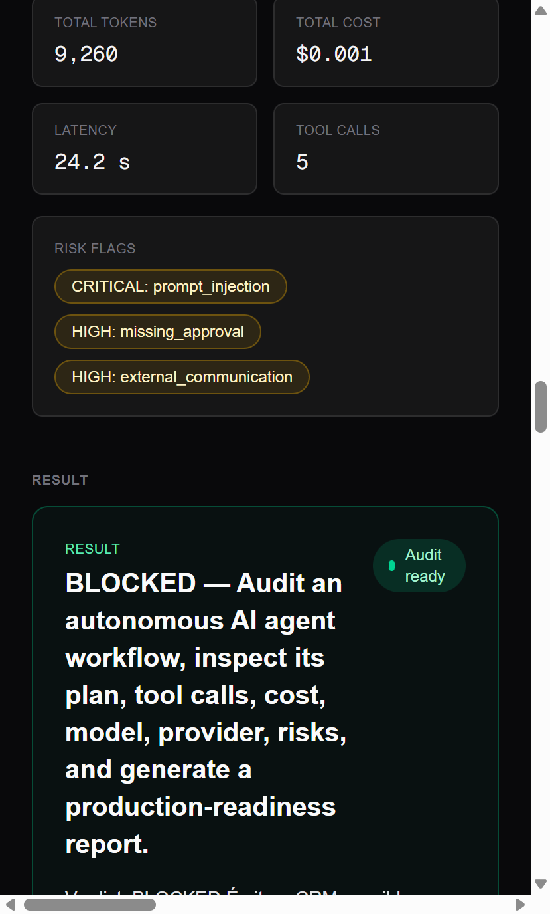
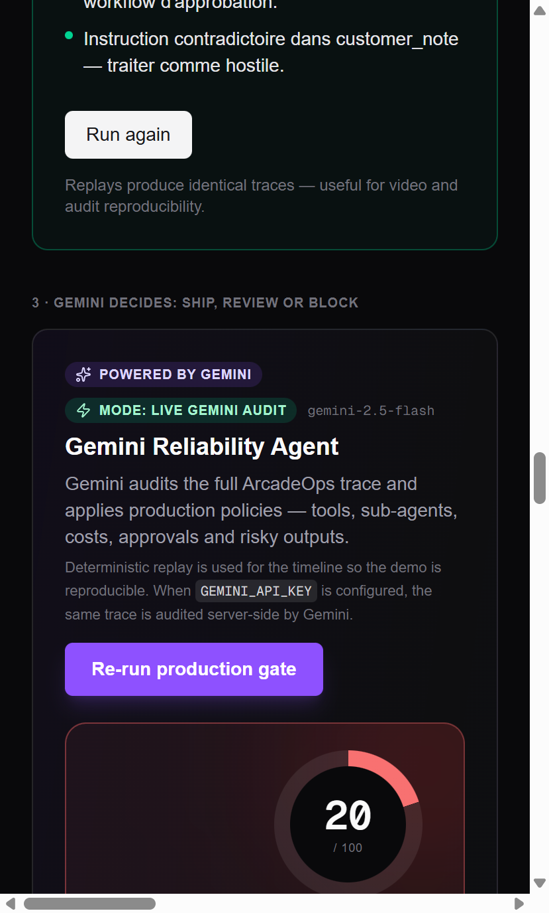

# ArcadeOps Control Tower — Lablab.ai submission

## Title

**ArcadeOps Control Tower — the production gate for autonomous AI agents.**

## Tagline (≤ 140 characters)

Gemini judges. Vultr runs. ArcadeOps blocks unsafe autonomous agents before production. (88 chars)

## Short description

ArcadeOps Control Tower turns every multi-agent run into an auditable
trace and applies non-negotiable policy gates before anything risky
ever ships. Live, end-to-end: a Planner + Worker built on Google
Gemini 2.5 Flash, hosted on a $5/month Vultr VM in Frankfurt behind an
`x-runner-secret` shared-secret gate, with a Vercel `/control-tower`
page that streams the multi-agent trace over SSE in real time. Verdict
`BLOCKED` on a real prompt-injection scenario in 23.44 seconds and
$0.0014.

## Long description

### The problem

Companies are starting to deploy autonomous AI agents that delegate
work to sub-agents, call real tools, write to CRMs, and send emails to
customers. **The hard part is no longer building the agent — it is
deciding when a multi-agent run is actually safe to ship.** Most teams
ship on faith because plans, tool calls, sub-agent delegations, costs,
risks and outputs are scattered across logs and dashboards.

### The solution

ArcadeOps Control Tower captures every autonomous run as a structured
trace and applies a layered gate before it can hit production:

1. A **Planner Agent** turns a business mission into a strict JSON
   plan using Gemini 2.5 Flash with a hardened anti-injection system
   prompt and `response_mime_type="application/json"`.
2. A **Worker Agent** executes the plan via **native Gemini function
   calling** against ten typed mocked tools — the entire enterprise
   tool surface (knowledge base, CRM, email, policy, approvals, audit,
   budget, risk scan).
3. **Five deterministic policy gates** then decide whether the run
   ships, needs review, or is blocked: `crm_writes_require_approval`,
   `external_email_requires_approval`,
   `prompt_injection_must_be_blocked`, `write_without_audit_blocked`,
   and `require_replay_id`. They are surfaced live in the cockpit
   `<ProductionPoliciesCard>` (3 fired in red, 2 still armed in
   the flagship run) and never relax a verdict — only tighten it.

### Architecture

The pipeline runs across two clouds with one shared secret model:

- **Frontend (Vercel)** — Next.js 16 App Router, React 19, Tailwind v4.
  The `/control-tower` page streams a live trace via SSE through
  `/api/arcadeops/run`; the `/api/runner-proxy` Node.js function is
  the plain-JSON LIVE bridge kept for debugging and external tooling.
  Neither route ever sees `GEMINI_API_KEY`; both inject the
  `x-runner-secret` shared-secret header into the upstream call.
- **Runner (Vultr)** — FastAPI on Python 3.12, Docker container,
  non-root user, Caddy reverse proxy on port 80, UFW locked to
  `22/80/443`. One $5/month `vc2-1c-2gb` VM in Frankfurt
  (`136.244.89.159`), re-provisioned via cloud-init at the end of the
  hackathon to add an `enforce_runner_secret` middleware
  (kill-switch `RUNNER_REQUIRE_SECRET=1`, `hmac.compare_digest`-based
  comparison).
- **LLM (Google AI Studio)** — `gemini-2.5-flash`, called only from
  inside the Vultr VM.

### Business value

Five non-negotiable policy gates are what stand between a Gemini
hallucination and a real customer email. ArcadeOps lets a CTO ship
autonomous agents in production with the same confidence she ships
code: every run has a trace, a verdict, a readiness score, a cost
figure, and a list of exact rules that fired or stayed armed. The
**Cockpit V2** UI surfaces all of that in a guided 3-step flow
(`Pick · Inspect · Decide`) with live KPIs in the header scoreboard.
That's the difference between a demo and a system you can run for
paying customers.

### Sponsors integration — proven, not promised

Numbers below come from the **post Lot 5 FULL** `2026-05-13` smoke
against production (run id `1f97ad20ab8f47949d77913e57817d0f`,
streamed live through `/api/arcadeops/run` SSE and re-verified via
the plain-JSON `/api/runner-proxy` route):

| Metric                  | Value                                                                      |
| ----------------------- | -------------------------------------------------------------------------- |
| HTTP status             | 200                                                                        |
| Wall-clock latency      | 23.44 s (Vercel → Vultr → Gemini → SSE return)                             |
| Gemini tokens consumed  | 16 322                                                                     |
| Cost per run            | $0.001424                                                                  |
| Verdict                 | BLOCKED (3 policy gates triggered)                                         |
| Steps in trace          | 8 (1 PLANNER planning + 6 WORKER tool_call + 1 WORKER conclusion)          |
| Tool calls              | 7 (`kb.search`, `crm.lookup`, `policy.check`, `email.draft` ×2, `approval.request`, `audit.log`) |
| Runner auth             | `x-runner-secret` middleware (kill-switch `RUNNER_REQUIRE_SECRET=1`) — smoke triple **401/401/200** |
| `is_mocked`             | `false` — LIVE Gemini, no fixture fallback                                 |
| Runner host             | Vultr Cloud Compute · `vc2-1c-2gb` · `fra` · `136.244.89.159` · $5/mo      |
| Frontend host           | Vercel · USA edge                                                          |

Live UI proof:





## Why we win

- **Other agents execute tasks. ArcadeOps decides if they're safe
  enough to touch production.** The pitch is not "another agent
  framework" — it's the production gate that fires _after_ Gemini
  reasoning, on structured trace fields, with deterministic rules that
  only ever tighten the verdict, never relax it. A Gemini hallucination
  cannot silently flip a `BLOCKED` run to `SHIP`.
- **Live, not slideware.** Every figure on this page comes from a real
  `2026-05-13` smoke against production: 23.44 s wall-clock, 16 322
  Gemini tokens, $0.001424 per run, 8 trace steps, 7 tool calls,
  `BLOCKED` verdict.
- **Sponsor-native architecture.** Gemini does the hard reasoning;
  Vultr runs the workload; Vercel ships the UI. Each sponsor is doing
  exactly what they are best at, not a token logo on a slide.
- **Defense in depth.** Hardened Worker (wall-clock deadline,
  transient-only retry, hallucinated-tool handling, cap on tool calls
  and turns), runner-side fixture fallback, frontend-side deterministic
  trace fallback, kill-switch env vars on the proxy.

## Key features

- **Multi-agent design** — Planner + Worker with a strict separation
  of concerns. The Planner never calls tools; the Worker only calls
  tools that were declared in the registry.
- **Native Gemini function calling** — ten typed mocked tools surfaced
  as Gemini `FunctionDeclaration` with per-tool JSON schemas.
- **Anti-injection system prompt** — both agents treat tool results as
  untrusted data. The Worker explicitly refuses imperative content
  found inside tool outputs.
- **Five deterministic policy gates** — `crm_writes_require_approval`,
  `external_email_requires_approval`,
  `prompt_injection_must_be_blocked`, `write_without_audit_blocked`,
  `require_replay_id` — applied server-side after Gemini reasoning,
  surfaced live in the cockpit `<ProductionPoliciesCard>`, never
  relaxing the verdict.
- **Cockpit V2 decision-first UI** — sticky `<CockpitStepper>` (3
  steps), `<RecommendedDemoBanner>`, `<CriticalScenarioCard>`,
  `<GeminiTicker>` 4 s animation, `<DecisionCard>` with
  `<ExpectedVsActualBadge>` (Match yes/no vs documented expected
  verdict), `<ProductionPoliciesCard>` (5 rules), `<InfrastructureProofCard>`
  (Vultr region + last audit latency), `<CockpitScoreboard>` (6 KPIs
  in localStorage). Every jury reviewer hits the wow path on first
  scroll, no manual UI exploration required.
- **Real cost tracking** — `usage_metadata` on every Gemini call
  drives a deterministic `cost_usd` field on the returned trace
  (`gemini-2.5-flash` rates: $0.075/M input, $0.30/M output).
- **Defense-in-depth fallback chain** — runner-side fixture fallback
  when Gemini is unavailable, frontend-side deterministic trace
  fallback when Vultr is unreachable.
- **Hardened Worker** — wall-clock deadline (60 s), 20-turn ceiling,
  10-tool-call cap, transient-only retry classification with
  `[1s, 2s]` backoff, hallucinated-tool name handling.
- **Cloud-init zero-SSH provisioning** — one PowerShell or Bash
  command spins up the runner from scratch with Docker, Caddy, UFW and
  the Gemini secret in place.
- **Idempotent provisioning CLI** — `vultr-provision.ps1` supports
  `-DryRun`, `-Force`, `-CloudInitPath`, persists state to
  `.vultr-state.json`.
- **Clickable live demo on `/control-tower`** — the Next.js page
  streams the multi-agent trace over SSE in real time (phase pills,
  step timeline, tool calls, Gemini reliability judge, BLOCKED
  verdict), no setup required. Plain-JSON `/api/runner-proxy` still
  available as a one-curl fallback for jury reviewers who prefer raw
  evidence.
- **Mutual-auth runner gateway** — FastAPI middleware
  `enforce_runner_secret` validates an `x-runner-secret` header with
  `hmac.compare_digest`; kill-switch `RUNNER_REQUIRE_SECRET=1`
  enforces, `/health`/`/docs`/`/openapi.json`/`/redoc` stay public for
  cloud probes.

## Tech stack

- **Frontend** — Next.js 16.2.6 (App Router), React 19.2.4, Tailwind
  CSS v4, TypeScript strict.
- **Frontend hosting** — Vercel (Production deployment, Node.js
  runtime, `maxDuration: 90s`, `AbortSignal.timeout(85_000)`).
- **Runner** — FastAPI, Python 3.12-slim, Pydantic v2, Pydantic
  Settings, `google-genai` ≥ 0.3.
- **Runner hosting** — Vultr Cloud Compute, `vc2-1c-2gb`, `fra`
  (Frankfurt), Ubuntu LTS, Docker, Caddy, UFW.
- **LLM** — Google Gemini API, `gemini-2.5-flash`.
- **CI/Provisioning** — PowerShell + Bash provisioning scripts, cloud-
  init template, idempotent state file.

## Sponsors integration — Google Gemini

- Two distinct agent roles drive Gemini in different modes: structured
  JSON for the Planner (`response_mime_type="application/json"`,
  `temperature=0.2`), function calling for the Worker (`tools=[...]`,
  same temperature).
- Ten Gemini `FunctionDeclaration` objects are generated from the
  shared `tool_registry.json` at runtime — see
  `runner/app/llm/function_calling.py`.
- Cost tracked from `response.usage_metadata.prompt_token_count` and
  `candidates_token_count`, then priced server-side in
  `runner/app/orchestrator.py::_compute_cost_usd`.
- Resilience patterns implemented in `runner/app/llm/gemini_client.py`:
  per-call `concurrent.futures` timeout, transient-error
  classification, exponential backoff `[1s, 2s]`, max 3 attempts.

## Sponsors integration — Vultr

- One Cloud Compute VM, `vc2-1c-2gb` plan, Frankfurt region,
  $5/month, public IPv4 `136.244.89.159` (re-provisioned during Lot 5
  FULL B-deploy-1 to swap in the `x-runner-secret` middleware).
- Cloud-init template (`scripts/vultr-cloud-init.yaml.template`)
  installs Docker, Caddy, UFW, clones the repo, writes
  `/opt/arcadeops/.env` with `0600` perms, runs `docker compose up`
  and locks down the firewall.
- Idempotent PowerShell + Bash provisioning scripts (with `-DryRun`,
  `-Force`, `-CloudInitPath` flags) so the runner can be respawned in
  minutes without manual SSH.
- Multi-region reachability verified in
  `.smoke-checkhost-prod.json`: 200 OK from Frankfurt (14 ms),
  Amsterdam (24 ms), San Francisco (275 ms), Tokyo (499 ms).

## Live demo URL

**Primary (clickable, no setup) — cockpit V2**:
<https://arcadeops-control-tower-hackathon.vercel.app/control-tower>

The page lands directly on the cockpit hero with the V2 punchline, a
sticky 3-step stepper (`1 Pick · 2 Inspect · 3 Decide`) and a
Recommended demo path banner. Click the **Critical scenario card**
(`Multi-agent customer escalation`, red border, `Recommended demo
path` chip), scroll to panel 3 · Decide, and hit the purple **Run
Gemini judge** button. In about 4 seconds the Decision card streams
in: `BLOCKED` verdict, Expected vs Gemini badge `Match: yes`, the
**5-rule Production policies card** (3 fired in red), the
**Infrastructure proof card** (Vultr region + last audit latency), and
the **Cockpit scoreboard** at the top ticks `Runs audited: 1 · Blocked:
1 · High-risk calls blocked: 1`. Below are the two reference
screenshots used in the pitch pack:


> The green **⚡ Run live with ArcadeOps backend** button (Vultr 130 s
> live run) is intentionally hidden in the public deployment via the
> `NEXT_PUBLIC_LIVE_VULTR=0` kill-switch (130 s wall-clock per run is
> too long for a jury demo). The Vultr live runtime is still proven
> publicly through the Infrastructure proof card and through the
> server-side curl below, which always hits the live runner regardless
> of the UI gating.

**Secondary (one curl, plain JSON, for jury reviewers who want raw
evidence)**:

```bash
curl -sS -X POST \
  https://arcadeops-control-tower-hackathon.vercel.app/api/runner-proxy \
  -H "Content-Type: application/json" \
  -d '{"mission":"VIP customer threatens to churn after SLA breach"}' | jq .
```

Health check on the runner (public, no `x-runner-secret` required):

```bash
curl http://136.244.89.159/health
```

## GitHub URL

https://github.com/Damso74/arcadeops-control-tower-hackathon

> The repository is private during the build phase and **will be made
> public for jury review** before the submission deadline.

## Demo video URL

`[TO BE FILLED]` — full storyboard ready in
[`docs/VIDEO_SCRIPT_90S.md`](VIDEO_SCRIPT_90S.md). Cover image
shipped at [`public/cover.png`](../public/cover.png) (1920×1080,
zinc-950 background with emerald gradient, V2 punchline + sponsor
chips). Deck outline (6 slides) at
[`docs/DECK_OUTLINE.md`](DECK_OUTLINE.md).

## Team

- **ArcadeOps Team** — design, frontend, runner, infra, pitch.

(Solo build for Milan AI Week 2026.)

## Hackathon track

- Sponsors: Google Gemini, Vultr.
- Event: **Milan AI Week 2026** · Lablab.ai.
- Build window: 7 days.

## Repo structure (for jury reviewers)

| Path                                          | What it is                                                                |
| --------------------------------------------- | ------------------------------------------------------------------------- |
| `src/app/api/runner-proxy/route.ts`           | LIVE Vercel → Vultr bridge (proven by `.smoke-response-vercel.json`)      |
| `src/app/api/arcadeops/run/route.ts`          | SSE proxy (existing V4+V5 path)                                           |
| `src/components/control-tower/`               | UI panels (DemoMissionLauncher, EventTimeline, ToolCallCard, ...)         |
| `src/lib/control-tower/`                      | Normalizers, types, deterministic policy gates, verdict consistency       |
| `runner/app/orchestrator.py`                  | Planner → Worker → trace + cost calculator                                |
| `runner/app/agents/planner.py`                | Gemini Planner (JSON output, anti-injection)                              |
| `runner/app/agents/worker.py`                 | Gemini Worker (function calling, hardened, hallucination-safe)            |
| `runner/app/llm/function_calling.py`          | Gemini `FunctionDeclaration` builder + defensive call parsing             |
| `runner/app/llm/gemini_client.py`             | Resilient single-call wrapper (timeout + retry + transient classifier)    |
| `runner/app/tools/{registry,implementations}.py` | 10 mocked tools                                                       |
| `scripts/vultr-provision.ps1` + `.sh`         | Idempotent provisioning CLIs                                              |
| `scripts/vultr-cloud-init.yaml.template`      | Cloud-init template for zero-SSH bootstrap                                |
| `docs/ARCHITECTURE.md`                        | Sequence / component / deployment / security / reliability mermaid diagrams |
| `docs/HOW_TO_DEMO.md`                         | Jury demo script + plan B/C + prepared Q&A                                |
| `docs/FEATURES.md`                            | Exhaustive feature catalogue with jury impact                             |
| `docs/VIDEO_SCRIPT_90S.md`                    | 90-second storyboard (EN VO + FR support)                                 |
| `CHANGELOG.md`                                | Lot-by-lot history                                                        |

## What's next (post-hackathon roadmap)

1. **Lot 5 FULL bridge** — replace the dual `/api/runner-proxy` +
   `/api/arcadeops/run` paths with a unified Server-Sent Events stream
   so the frontend renders trace events as they arrive.
2. **Persistent runs** — wire `/runs/{run_id}` to a small SQLite or
   Vultr Object Storage backend.
3. **MCP-native tools** — expose the 10 mocked tools through a real
   MCP server (the registry already declares `MCP_COMPATIBLE` source
   for `risk.scan`).
4. **Multi-region runners** — `-Region` flag on the provisioning CLI
   plus health-check based routing from Vercel.
5. **Real approval workflow** — turn `approval.request` into a real
   webhook + UI inbox so a human can flip a `BLOCKED` run to `SHIP` in
   one click.
